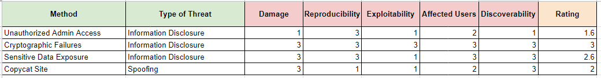

### Must Have

> 1. A bulleted list of appropriate governing bodies and regulations you believe apply to the assigned website
> 2. Shortlist of the intended audience, potential information that may be held, the industry (which may affect the sensitivity of the data), and the functionality
> 3. A bulleted list of potential vulnerabilities based on the regulations (based on framework analysis)
> 4. Tabular summary of recommendations & mitigations, based on theoretical assessments and ordered by business priority
> 5. Remember to check your presentation, spelling, and structure (proofreading is a good idea).

### A. Proposed
#### A.1. About the Site

**Intended Audience**

> UK Customers

**Information that maybe held**

> - Behavioral Data
> - Purchase Data
> - Personal Identifier Information
> - Payment Data

**Industry**

> Internet Commerce

**Offered Service**

> Marketplace

#### A.2. Possible Security Risk and Its Governing Body

1. Unauthorized Access
   - Body: The European Parliaments and Of The Council
   - Scenarios: Bruteforce Login
   - Related Link:
     - https://eur-lex.europa.eu/legal-content/EN/TXT/HTML/?uri=CELEX:32013L0040&rid=5
2. Cryptographic Failure
   - Body: European Union
   - Scenarios: Payment
   - Related Link:
     - https://gdpr-info.eu/art-25-gdpr/
3. Sensitive Data Exposure
   - Body: European Union
   - Scenarios: Personal Data Breach
   - Related Link:
     - https://gdpr-info.eu/art-25-gdpr/

#### A.3. Threat Modelling

#### A.4. Mitigations

**Unauthorized Admin Access**

- Enable 2FA
- IP Lock for Admin page
- Use complicated password

**Cryptographic Failure**

Refer to OWASP recommendation: [https://owasp.org/Top10/A02_2021-Cryptographic_Failures/](https://owasp.org/Top10/A02_2021-Cryptographic_Failures/)

**Sensitive Data Exposure**

- Limit who can access sensitive data
- Disable caching
- Encrypt sensitive data transmission
