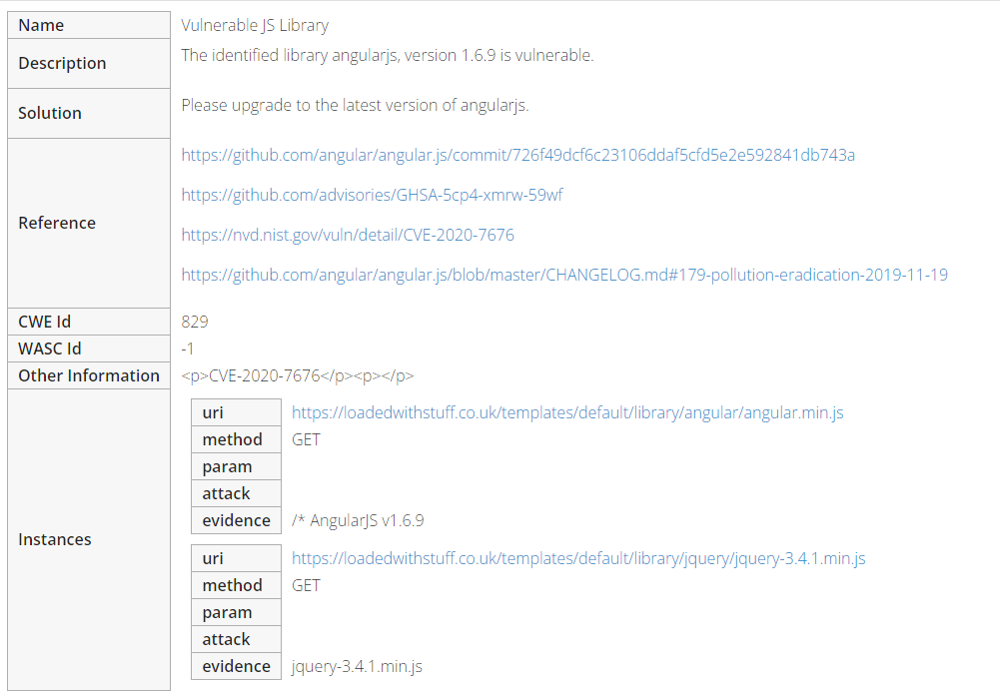
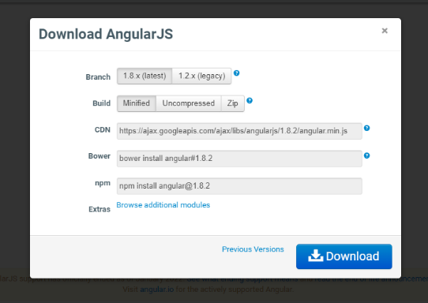
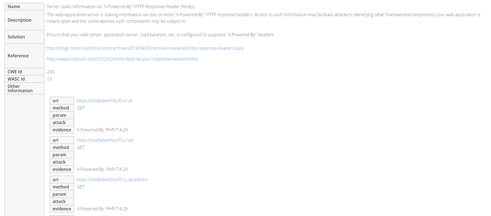

### Goal

> Testing possible vulnerabilities listed on the design document

### 1. Vulnerable and Outdated Components

Found two outdated components:

- Javascript. 
  - According to https://hostedscan.com, the website is still using AngularJS version 1.6.9 (Figure 1), whereas the latest is 1.8.x (Figure 2). 
  - Moreover, AngularJS is dying according to its official announcements (Thompson, 2022).
- PHP. 
  - The PHP version being used is also outdated. According to hostedscan.com, the site is still using version 7.4.29 (Figure 3). The latest version is PHP 8.x. 
  - According to https://php.watch, between the current version and the latest version, there are a lot of security patches released (Karunaratne, 2022).
    - For example, there is an access violation patch in PHP 8.0.2 (bug #76813) (PHP :: Bug #76813 :: Access_violation_near_NULL_on_source_operand, 2022).

### References

Karunaratne, A., 2022. PHP 8.1.3, 8.0.28, and 7.4.28 released with security and bug fixes. [online] PHP.Watch. Available at: <https://php.watch/news/2022/02/php-security-release> [Accessed 30 May 2022].

Thompson, M., 2022. Discontinued Long Term Support for AngularJS. [online] Medium. Available at: <https://blog.angular.io/discontinued-long-term-support-for-angularjs-cc066b82e65a> [Accessed 30 May 2022].

Bugs.php.net. 2022. PHP :: Bug #76813 :: Access_violation_near_NULL_on_source_operand. [online] Available at: <https://bugs.php.net/bug.php?id=76813> [Accessed 30 May 2022].

### Appendix

Figure 1. Hosted Scan Results

Figure 2. Latest version of AngularJS

Figure 3. Outdated PHP Version

