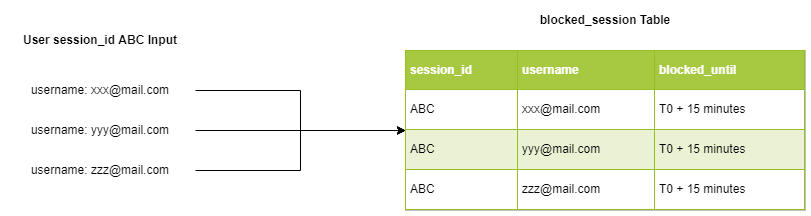

Our final product is different from our design proposal document. Several features that we committed earlier was deprioritized. Those features are Trust-based authorization and encrypt-decrypt based on user key. Trust-based authorization is a mechanism to approve or reject user login based on the login attempt logs and several other features like IP, location, etc. While the encrypt-decrypt based on user key feature is a feature that will encrypt user data in the database, but user will be asked for a key if they want to view or download their decrypted data from the database.

For the design document, we didn’t really take into account the estimated time a task will take. Thus, we were adding everything into the document. Of course, we did some review about features we added in the design document. But only during the implementation we realized that not everything is as easy as we thought. Other than that, we also didn’t plan some slot for bug fixing. In the middle of the development, we were all agreed on a new task’s prioritization as well as to change our approach to fulfil the requirement.

For example is the trust-based authorization, to capture user’s IP is not easy. Thus we change it into a more simplified approach based on the user input and the user’s session. Every time the user runs the program, a new randomly-generated session_id will be created. Let’s say the user input is all wrong three times, the program will store every input, and add them into the blocked_session table that holds all blocked login attempt and the related user used in the attempt (pictured below).

 
Our login mechanism is also scaled up to be integrated with the blocked_session table. On user login verification, the program will check whether the username is contained inside the blocked_session table or not. If it exists, it will then check if current time is less than blocked_until of that username and reject the login if yes – since it means that that particular username is still being blocked. So, even though the real user is inputting the correct credentials for login, he won’t be able to login. This kind of method is inspired by Facebook and other social media platforms if they detect an unusual login attempt.

Despite simplifying or changing feature during the implementation, we are still aiming to achieve the original goal. We made sure everything is still as expected –  trust-based authorization was proposed to mitigate brute force attack, we created unit-testing scripts that will test our code against multiple scenarios. We were not only testing that our feature runs smoothly from end-user side, but also security-related scenarios.
