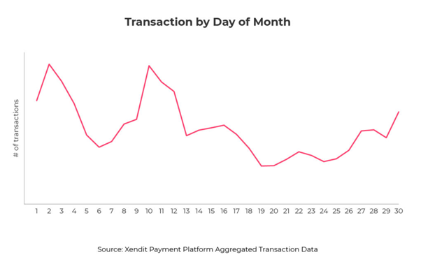

# Digital Marketing of Small and Medium Scale Enterprises in Jakarta, Indonesia 

## Introduction
At the beginning of the COVID-19 pandemic, Small and Medium Enterprises (SMEs) is one of the most severely affected. The cashflow shortage is one of the biggest operational challenges that is caused by decreased revenue (United Nations Industrial Development Organization, 2021). Paying back loans and electricity bills, and employee salaries are several SME operational components that are faced with difficulties (Bahtiar, 2021) In response to this, several SMEs were laying off some of their employees to survive, reducing employee operational hours, or even closing their operation entirely in some areas.

Despite the negative impact, the COVID-19 pandemic also brings positive impacts to those who are capable enough to adapt to difficult situations. In a report, while the majority were experiencing negative impacts, there are also small numbers of businesses that can turn the situation to their favour, resulting in a positive impact – e.g., increased revenues, a growing number of customers, etc. (Setyoko & Kurniasih, 2022). Digitalization of business operations is key to surviving the pandemic as there are shifts in consumer behaviours. This shift is also continuous even after the pandemic where most consumers are staying to shop online (Tjiptono, et al., 2022).

After two years of the pandemic, the Indonesian government started to focus on recovering its economy starting in Q1 2022. As one of the biggest gross domestic product contributors, supporting SMEs is their priority. One of the initiatives that are taken is to accelerate digital transformation and adoption among SMEs, aiming to bring 30 million SMEs to the digital market by 2024 (Fardah, 2022). This bold initiative is not without any challenges. Most SMEs in Indonesia are low in IT literacy, its populations are not knowledgeable about using digital technology and digital information (Arifia, 2022). IT literacy affects technology adoption among SMEs (Raharjo, et al., 2022).

Having the knowledge of how to do business online, or how to integrate technology into the business process is one of the barriers to the digitalization of SMEs (Stewart, et al., 2021). Stewart, et al. (2021) surveyed Jakpreneur participants, a government regional program to aid and assist SMEs business in Jakarta and found that they do not know how to properly do digital marketing. There is a probability that the cost of digital marketing will be high due to misdirection (Stewart, et al., 2021). In an article, Forbes illustrated how with bad marketing practices 94% of the cost is wasted. In other words, it is possible to save 94% of the marketing cost while still achieving maximum business outcomes with the correct way of doing digital marketing (Fou, 2020).

## Literature Review
### Digital Marketing

Digital marketing is an activity of marketing using online channels and mediums such as email, website, webinar, or social media (Miller, 2012). Unlike traditional marketing, digital marketing aims to give marketers a wider reach audience (Narayan, 2015). In digital marketing, cooperation between the marketing and technology team is expected (Lunka, 2013). Nowadays, digital marketing is one of the most popular forms of direct marketing, replacing traditional direct marketing (Kotler & Armstrong, 2017).

Like traditional marketing, digital marketing needs a strategy. In their book, Kotler & Armstrong (2017) defined four components of marketing strategy: segmentation, targeting, differentiation, and positioning. The marketing strategy will define the audience it will serve through segmentation and targeting, and how to best serve them through differentiation and positioning. After it is all defined, marketers need to define an integrated marketing mix, known as the four Ps – product, price, place, and promotion. To make the most out of every marketing activity, every marketing should have management which consists of analysis, planning, implementation, organization, and control.

### Context of Small and Medium Enterprises in Indonesia

The government of Indonesia classify SMEs as business that is having a capital of less or equal to IDR 5 billion excluding the building and land assets (Ministry of Investment, n.d.). There are around 65 million SMEs in Indonesia in 2020 (Kameke, 2022). In 2018, a survey found that only 1.3% of SMEs in Indonesia is having an online presence (Statista Research Department, 2021). After the pandemic hit, there is an increase in the number of SMEs with an online presence. The government data said that around 19% of registered SMEs – around 12 million SMEs are connected with the digital ecosystem (Humas Kementerian Koperasi dan UKM, 2021). Despite the rapid adoption of technology among SMEs in 2018-2021, Kementerian Koperasi dan UKM (Ministry of Cooperatives and Small & Medium Enterprises) reports that 75% of them are still struggling to integrate technology into their business. In another article by the Ministry of Technology and Communications, it is said that they don’t know how to build their brand image online and do online ads. 

## Discussion
After defining the goal of digital marketing activity, be it to build brand awareness, increase sales, or introduce a new product, knowing who to target is the next step to do in the marketing process flow. Known as segmentation, various models can be used: demographic, geographic, psychographic, technographic, behavioural, needs-based, and value-based segmentation (Baker, 2022).

| Segmentation Model | Variable Examples |
|--------------------|-------------------|
| Demographic | Age, gender, income, education, and marital status |
| Geographic | Country, state, city, and town |
| Psychographic | Personality, attitude, values, and interests |
| Technographic | Mobile-use, desktop-use, and software |
| Behavioural | Tendencies and frequent actions, feature or product use, and habits |
| Needs-based | Product or service must-haves and needs of specific customer groups |
| Value-based | The economic value of specific customer groups in the business |
Table 1. Customer segmentation model (Baker, 2022)

Defining the marketing strategy is the stage that relies heavily on data and requires analysis. Both are something that is not easy for SMEs in Indonesia. The detailed customer segmentation and its personas might be different for one business and another, yet, we can look into industry data and market analysis reports for the general overview.

People tend to buy necessities offline rather than online (Deloitte, 2021). Electronics, fashion, and hobby products are the top 4 of most selling products online (Nugroho, 2020). The range in the top average spending on each purchase is between IDR 0 – 250.000 (Nugroho, 2020). And most consumers are purchasing through popular e-commerce apps rather than HTML websites with Shopee, Tokopedia, and Lazada as the top three platforms (Nugroho, 2020).

Choosing where to run the campaign is the next step after deciding on the segmentation and targeting. The output of the previous stage will help to decide which campaign runs on which platform. YouTube is one of the most popular social media used by the majority of all age groups  TikTok is not popular among people ages 35 and above, and Instagram is most popular on people on people ages 18-29 (Kushner, 2022). The report (Kushner, 2022) might be global, but the insight indicates that there are different personas of users between each social media platform. Thus, after defining the marketing target, it is important to choose where to run the campaign to maximize the outcome.

When choosing the channel, it is also possible to choose more than one channel for the campaign. Having an omnichannel marketing strategy is one way for a business to stay competitive (Chi, 2022). An omnichannel marketing strategy means that the marketing campaign will be present in the customer journey from discovery to purchase and even after-sales period (Shih, 2016). To succeed in an omnichannel strategy, we need to maintain consistency across these channels since it will be affecting the interaction experience between users and businesses (Shih, 2016).

The next stage is differentiation and positioning. At this stage, it is time to look at competitors and spot their existing value propositions on their existing offerings. Identifying differentiation and positioning will help marketers make sure that the marketing campaign will be delivered with a strong and distinctive message to the audience (Lodish, et al., 2015). It is the beginning of a relationship that is built between the customer and the business (Kotler & Armstrong, 2017).

For example, audiences in Indonesia started to care about carbon footprints in their daily lives (Maini, 2022). They believe that brands are responsible for their environmental impact. Aligned with Indonesia’s commitment to sustainability, people tend to choose the more environmentally friendly product and way of life. Another insight found is that people start to care more about their financial situation, people tend to choose the buy now, pay later way of financing (Maini, 2022). And they also want to get the product they bought as soon as possible with the rise of the ‘same-day delivery’ search on Google.

After we have defined our marketing strategy, building up the 4 P’s of the marketing mix is what to do next. It is the architecture of every marketing campaign. Based on the analysis of the marketing target and how to best serve the target, the marketing mix define the tactic of the marketing campaign (Kotler, 2012). It defines the two dimensions of marketing: 
1. Offer: Product and Price
2. Access: Place and Promotion

According to Kotler (2012), there are three types of marketing mixes: destructive, me-too, and creative marketing mix. A destructive marketing mix is a marketing mix that doesn’t add value to the company. A me-too marketing mix is a marketing mix that imitates competitors. The last one, creative marketing mix is a marketing mix that adds value to the company because it supports the marketing strategy.

We have defined our marketing strategy, and we have also designed the architecture of the marketing campaign. Before the execution of the campaign, we need to define the implementation. Taking care of how the campaign will run and planning it carefully will help marketers to better manage the marketing spending (Xendit, 2022). In digital marketing, running a marketing campaign when no one is online or less likely to purchase will only drain the marketing budget.



Table 2 Most popular day of the month to purchase (Xendit, 2022)

According to Xendit (2022), people are most likely to do purchases on the 2nd and 10th day of the month. The trend of purchases will then go down after the 10th day with Tuesday as the most popular day of the week to do purchases. Breaking it down into more detail, the behaviour of purchasing electronics is more frequent on Monday and Sunday. Whilst beauty & health products are more popular on Friday. Fashion product purchases are equally popular on all days of the week.

One last important thing is to define how to measure the effectiveness of a marketing campaign. Usually, the ROI of a marketing campaign is calculated through the following simple formula (Beatti, 2022):

```ROI = ( Sales Growth - Marketing Cost ) / Marketing Cost```

Nowadays, there are several more ways to determine the effectiveness of a marketing campaign. Three approaches can be used (Hemann & Burbary, 2018):

Measuring the effectiveness. This approach is to determine how effective a marketing channel is. For example, measuring the reach and engagement rate of each marketing channel.

Measuring the efficiency. This will help to determine the efficiency of each money spent on a marketing channel. For example, cost per engagement (CPE), cost per acquisition (CPA), or cost per view (CPV).

Measuring the effect. This approach will tell the outcome of the marketing campaign to the company. This is where the traditional ROI fits in.

Being able to collect the data to analyse the performance of the marketing campaign through the three approaches is important since it will help marketers to better plan, design, and execute future marketing campaigns. 

## Conclusion
Digital marketing is like traditional marketing, but with some more added to it. To be effective, marketers need to carefully design their marketing campaign thoroughly. Who to target and how to best target them, how the journey will be, and most importantly, how to obtain and connect all this data for analysis. Digital marketing is more of a data-driven marketing. Thus, data collection should be the priority before doing any kind of digital marketing. 

## References
Arifia, I., 2022. Low Digital Literacy in Indonesia, It Needs to be Introduced Early. [Online] 
Available at: https://news.unair.ac.id/2022/03/24/low-digital-literacy-in-indonesia-it-needs-to-be-introduced-early/?lang=en
[Accessed 7 November 2022].

Bahtiar, R. A., 2021. Impacts of the COVID-19 Pandemic on the Micro, Small and Medium Business Sector and the Solutionsy. INFO Singkat, Volume 13, pp. 19-24.
Baker, K., 2022. Customer Segmentation: How to Effectively Segment Users & Clients. [Online] 
Available at: https://blog.hubspot.com/service/customer-segmentation
Beatti, A., 2022. How to Calculate the Return on Investment (ROI) of a Marketing Campaign. [Online] 
Available at: https://www.investopedia.com/articles/personal-finance/053015/how-calculate-roi-marketing-campaign.asp
Chi, C., 2022. Which Marketing Channels Will Brands Prioritize in 2022 [HubSpot Blog Data]. [Online]

Available at: https://blog.hubspot.com/marketing/marketing-channels
Das, K. et al., 2018. The Digital Archipelago: How Online Commerce is Driving Indonesia's Economic Development, s.l.: McKinsey & Company.
Deloitte, 2021. Deloitte Consumer Insights: Adapting to the New Normal, s.l.: s.n.
Fardah, 2022. Indonesia Strives to Expand Coverage of Digitalization of MSMEs. [Online]

Available at: https://en.antaranews.com/news/250089/indonesia-strives-to-expand-coverage-of-digitalization-of-msmes
Fou, A., 2020. The Cost-Performance Paradox Of Modern Digital Marketing. [Online] 
Available at: https://www.forbes.com/sites/augustinefou/2020/08/18/the-cost-performance-paradox-of-modern-digital-marketing/?sh=2439dec72a9c
[Accessed 7 November 2022].

Hemann, C. & Burbary, K., 2018. Digital Marketing Analytics: Making Sense of Consumer Data in a Digital World. 2nd ed. s.l.:Que.
Humas Kementerian Koperasi dan UKM, 2021. Target Pemerintah 30 Juta Umkm Masuk Ekosistem Digital Pada Tahun 2024. [Online] 
Available at: https://kemenkopukm.go.id/read/target-pemerintah-30-juta-umkm-masuk-ekosistem-digital-pada-tahun-2024
[Accessed 2022].

Kameke, L. v., 2022. Number of Micro, Small, and Medium-Sized Enterprises (MSMEs) in Southeast Asia in 2020, by Country. [Online] 
Available at: https://www.statista.com/statistics/1317131/asean-number-of-micro-small-medium-sized-businesses-by-country/
[Accessed November 2022].

Kotler, P., 2012. Rethinking Marketing: Sustainable Marketing Enterprise in Asia, Second Edition. 2nd ed. s.l.:Pearson.

Kotler, P. T. & Armstrong, G., 2017. Principles of Marketing. 17 ed. s.l.:Pearson.

Kushner, J., 2022. The 2022 Social Media Demographics Guide. [Online] 
Available at: https://khoros.com/blog/social-media-demographics-guide

Lodish, L. M., Morgan, H. L., Archambeau, S. & Babin, J., 2015. Marketing That Works: How Entrepreneurial Marketing Can Add Sustainable Value to Any Sized Company. 2nd ed. s.l.:Pearson.

Lunka, R. D., 2013. Adobe® Experience Manager: Classroom in a Book®: A Guide to CQ5 for Marketing Professionals. s.l.:Adobe Press.

Maini, D. S., 2022. Search Pulse Insights: What’s Top of Mind for Consumers in Indonesia Now. [Online] 
Available at: https://www.thinkwithgoogle.com/intl/en-apac/consumer-insights/consumer-trends/indonesia-search-trends-consumer-behavior/

Miller, M., 2012. B2B Digital Marketing: Using the Web to Market Directly to Businesses. s.l.:Que.

Ministry of Investment, n.d. Surviving as Small and Medium Enterprises in Indonesia. [Online] 
Available at: https://www3.bkpm.go.id/en/publication/detail/news/surviving-as-small-and-medium-enterprises-in-indonesia
[Accessed 7 November 2022].

Narayan, S., 2015. Agile IT Organization Design: For Digital Transformation and Continuous Delivery. s.l.:Addison-Wesley Professional.

Nugroho, S., 2020. Perilaku Konsumen Papan Pasar Daring Indonesia. [Online] 
Available at: https://www.youtube.com/watch?v=jBmqFtmhlNs&t=4089s
[Accessed 2022].

Raharjo, K., Prasetya, A., Nurlaily, F. & Prakasa, Y., 2022. IT Literacy and Technology Adoption: SMEs Response During COVID-19 Pandemic. Surabaya, s.n.

Setiawan, I., Kartajaya, H. & Kotler, P., 2021. Marketing 5.0. s.l.:Wiley.

Setyoko, P. I. & Kurniasih, D., 2022. Impact of the COVID-19 Pandemic on Small and Medium Enterprises (SMEs) Performance: A Qualitative Study in Indonesia. Journal of Industrial Engineering & Management Research, pp. 315-324.

Shih, C., 2016. The Social Business Imperative: Adapting Your Business Model to the Always-Connected Customer. s.l.:Addison-Weasley Professional.

Statista Research Department, 2021. Share of Respondents With Micro, Small and Medium Enterprises (MSME) Whose Company Has a Website in Indonesia As of 2018. [Online] 
Available at: https://www.statista.com/statistics/984752/indonesia-msmes-online-presence/
[Accessed November 2022].

Stewart, H. et al., 2021. Digital Business Transformation: Building COVID-19 Resilience in Indonesian SMEs, s.l.: The Australia-Indonesia Centre.

Tjiptono, F., Khan, G., Ewe, S. Y. & Dharmesti, M., 2022. Consumer Behavior During and Post-COVID-19 in Indonesia and Malaysia. COVID-19 and the Evolving Business Environment, pp. 205-233.

United Nations Industrial Development Organization, 2021. Impact Assessment of COVID-19 on Indonesia's Manufacturing Firms. [Online] 
Available at: https://www.unido.org/sites/default/files/files/2021-03/UNIDO%20COVID19%20Assessment_Indonesia_FINAL.pdf
[Accessed November 2022].

Xendit, 2022. When Are Users Most Likely To Shop Online? A Guide to Indonesia eCommerce Market. [Online] 
Available at: https://www.xendit.co/en-id/blog/when-do-indonesian-shop-online/


