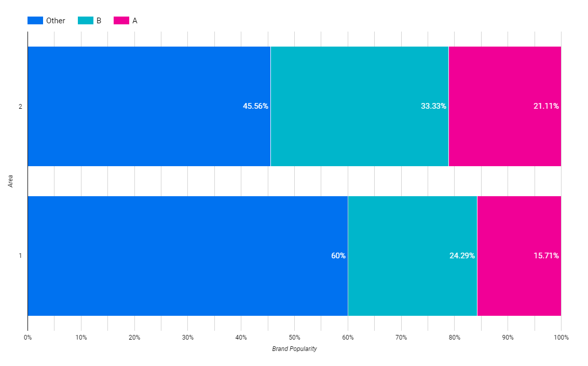
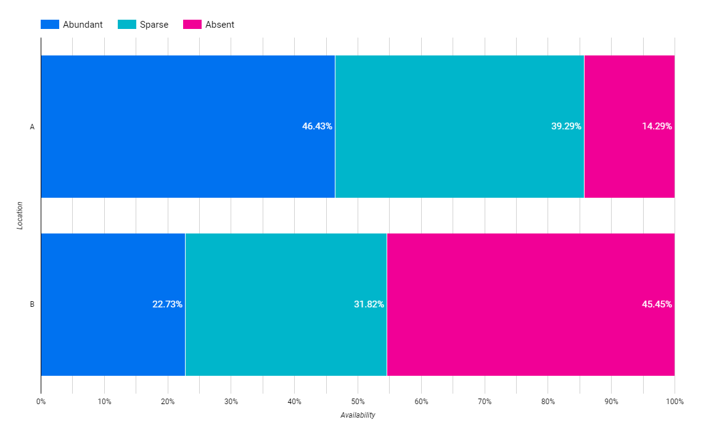
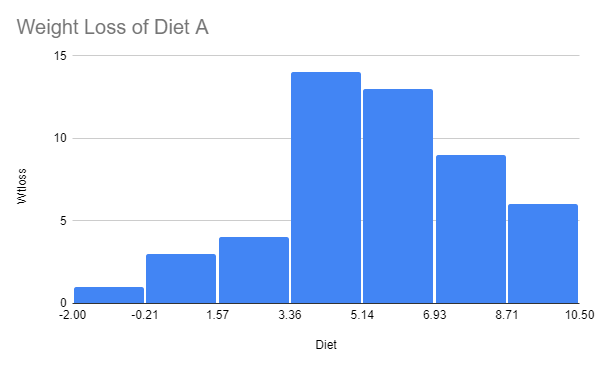
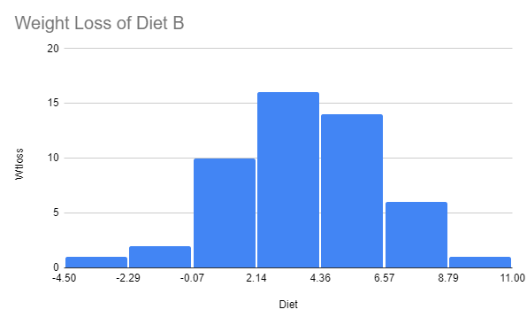

#### Exercise I

Open the Excel workbook in Exe 9.1D.xlsx from the Exercises folder. This contains the percentage frequencies together with the bar chart just created in the above example. Add a percentage frequency bar chart showing the brand preferences in Area 2, using the same format as that employed for the Area1 results in the above example. Drag your new chart so that it lies alongside that for Area 1.

Briefly interpret your findings. What do these results tell you about the patterns of brand preferences for each of the two demographic areas?

##### Exercise I Results

**Charts**

**Interpretation**

Brand B is the market leader since they are the most popular in both areas, the second lead is held by brand A. To be the most popular brand in both areas, on average, brand A is only 10% behind brand B.

#### Exercise II

Open the Excel workbook in Exe 9.2E.xlsx from the Exercises folder. This contains the frequency distributions for Data Set E (see the Data Annexe) to which has been added the corresponding percentage frequency distributions. Complete a percentage frequency clustered column bar chart showing the heather species prevalences in the two different locations.

Briefly interpret your findings.

##### Exercise II Results

**Charts**

**Interpretation**

We can find the heather species more in location A. In almost 50% of locations A heather species is abundant and 14% absent.

#### Exercise III

Open the Excel workbook in Exe 9.3B.xlsx from the Exercises folder. This contains the relative frequency histogram for the Diet A weight loss produced in Example 9.3 together with some of the Diet B weight loss summary statistics. Add a relative frequency histogram of the weight loss for Diet B, where possible using the same classes as those employed for the Diet A results in the above example. 

Briefly interpret your histogram. What do these results tell you about the patterns of weight loss for each of the two diets?

##### Exercise III Results

**Charts**

Wight Loss of Diet A

Weight Loss of Diet B

**Interpretation**

Diet A is more effective in losing weight. On diet A, the first, second, and third bars of the most weight loss is bigger than 3.36, unlike diet B which the third bar is -0.07 to 2.14. Despite that, diet B is giving the possibility of losing the most weight. The maximum weight loss on diet B is 11.00, whilst diet A is only 10.50.

The distribution may change if only we can find out what the subject was doing with diet B so that they can get 11.00 weight loss and then instruct the same to other subjects on diet B.
